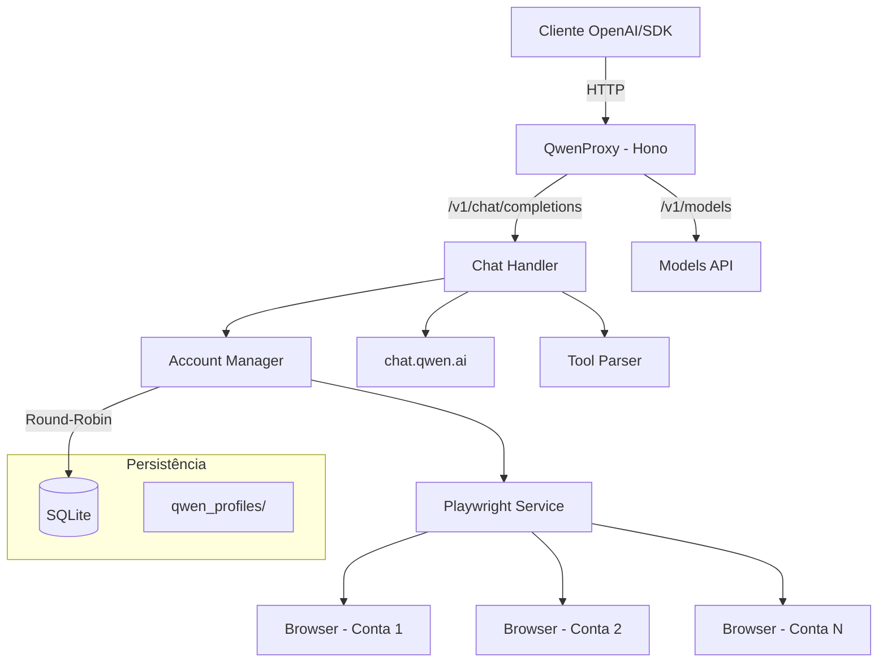

# QwenProxy

Proxy API local compatível com OpenAI que roteia requisições para os modelos do **Qwen (chat.qwen.ai)** via automação de navegador com Playwright. Suporte a múltiplas contas com rotação automática, execução de ferramentas, modo de pensamento (reasoning), persistência de sessão e armazenamento em SQLite.

[](https://github.com/pedrofariasx/qwenproxy/actions/workflows/ci.yml)
[](https://www.typescriptlang.org/)
[](https://hono.dev/)
[](https://playwright.dev/)
[](LICENSE)

---

## Features

- **Multi-Protocol** — Supporte OpenAI, Anthropic Messages et Google Gemini APIs.
- **Custom Model Mapping** — Routez les modèles vers Qwen avec mapping flexible et hot-reload.
- **OpenAI API Compatible** — Interface compatível com `/v1/chat/completions`, `/v1/models` e `/v1/upload`.
- **Anthropic Compatible** — Endpoint `/v1/messages` pour Claude Code, Cursor, etc.
- **Gemini Compatible** — Endpoint `/v1beta/models/:model/generateContent`.
- **Multi-Account** — Gerencie múltiplas contas Qwen com rotação round-robin e cooldown automático.
- **Guest Mode** — Modo convidado sem necessidade de login, usando a API pública do Qwen.
- **Request History** — Historique complet avec SQLite, filtrage et statistiques.
- **Web Dashboard** — Interface web avec stats temps réel, charts et éditeur de mapping.
- **SQLite Storage** — Contas salvas em banco de dados SQLite (WAL mode) para performance e confiabilidade.
- **Reasoning Support** — Suporte completo ao modo de pensamento (thinking) dos modelos Qwen.
- **Multimodal Upload** — Envio de imagens, vídeos, áudios e documentos via `/v1/upload`.
- **Tool Execution** — Sistema de execução de ferramentas locais integrado ao fluxo do chat.
- **Rate Limiting** — Rate limiter par API key et IP avec headers standard.
- **Circuit Breaker** — Protection contre les cascades d'échec.
- **Session Persistence** — Perfil de navegador persistente por conta em `qwen_profiles/`.
- **Auto-Login** — Login automático via credenciais com recuperação de sessão.
- **Browser Selection** — Escolha entre Chromium, Chrome, Firefox, Edge ou WebKit.
- **Anti-Detection** — Stealth script avancé et captcha solver automatisé (Baxia).
- **Monitoring** — Health check détaillé, métricas Prometheus e watchdog integrados.
- **Redis Support** — Support Upstash REST pour deployments serverless.
- **Serverless Ready** — Deploy sur Vercel, Netlify, etc.
- **CLI Binary** — Instale globalmente via npm e use o comando `qwenproxy` diretamente.
- **Docker Ready** — Deploy para VPS com Docker, volumes persistentes e graceful shutdown.
- **⚡ Speed Optimization** — Zero-copy stream, TLS pool, CDP batching, WebSocket bridge, browser-direct mode, Service Worker cache (6x faster, 240x on cache hit).

---

## Arquitetura



### ⚡ Speed Optimization (Vitesse Éclair)

```
Control Plane (Node.js) ←→ WebSocket /ws/signaling ←→ Browser
Data Plane (Browser) ←→ Qwen API direct (HTTPS)
```

| Phase | Description | Gain |
|-------|-------------|------|
| 1 | Zero-Copy Stream — Template-based SSE rewriting | 10-50x/chunk |
| 2 | CDP Bridge Elimination — Batching + WebSocket | 50-200x |
| 3 | TLS Connection Pool — HTTP/2 multiplexing | 100-300ms |
| 4 | Client-Side SSE — Service Worker | 50-200ms |
| 5 | Browser-Direct Mode — WebSocket signaling | BYPASS |
| 6 | HTTP/3 + QUIC — 0-RTT | 50-150ms |
| 7 | Cache Multi-Niveaux — IndexedDB + SW | 0ms hit |
| 8 | Monitoring — Auto-switch path | fiabilité |

**Config:** `FAST_STREAM_PROXY=true TLS_POOL_SIZE=5 npm start`
**Benchmark:** `npm run bench`
**Docs:** [SPEED.md](SPEED.md)

---

## ⚙️ Hot-Reload Configuration

Toda configuração pode ser modificada em tempo real sem reiniciar o servidor.

### Via API

```bash
# Ver configuração completa
curl http://localhost:3000/api/config/server

# Modificar um timeout
curl -X PUT http://localhost:3000/api/config/server \
  -H 'Content-Type: application/json' \
  -d '{"path":"timeouts.http","value":60000}'

# Passar para modo browser (desativar direct fetch)
curl -X PUT http://localhost:3000/api/config/server \
  -H 'Content-Type: application/json' \
  -d '{"path":"directFetch","value":false}'

# Atualização em lote
curl -X PUT http://localhost:3000/api/config/server/batch \
  -H 'Content-Type: application/json' \
  -d '{"updates":[{"path":"timeouts.http","value":45000},{"path":"cache.defaultTTL","value":7200}]}'

# Resetar para padrões
curl -X POST http://localhost:3000/api/config/server/reset
```

### Via Dashboard

Acesse `http://localhost:3000` → aba **⚙️ Paramètres** para editar todos os valores diretamente na interface web.

### Categorias de Configuração

| Tipo | Exemplos | Comportamento |
|------|----------|---------------|
| **Hot-reload imediato** | `timeouts.*`, `cache.*`, `directFetch`, `apiKey` | Efeito imediato na próxima requisição |
| **Hot-reload com ação** | `browser.headless`, `browser.type`, `metrics.interval` | Reinicializa subsistema automaticamente |
| **Requer restart** | `server.port`, `server.host`, `redis.*` | Valor salvo, efeito no próximo restart |

### Persistência

As alterações são salvas em `config/runtime-config.json` e restauradas automaticamente no próximo início do servidor.

---

## 🐛 Debug Mode

Modo de diagnóstico que captura toda a atividade interna do proxy.

### Ativar/Desativar

```bash
# Via API
curl -X POST http://localhost:3000/api/debug/toggle

# Verificar status
curl http://localhost:3000/api/debug/status

# Consultar logs
curl http://localhost:3000/api/debug/logs

# Filtrar por categoria
curl "http://localhost:3000/api/debug/logs?category=ERROR"

# Limpar logs
curl -X DELETE http://localhost:3000/api/debug/logs
```

### Via Dashboard

Acesse `http://localhost:3000` → aba **🐛 Debug** para ativar/desativar e visualizar logs em tempo real.

### Categorias de Logs

| Categoria | Descrição |
|-----------|-----------|
| `REQUEST` | Requisições recebidas (model, stream, messageCount) |
| `RESPONSE` | Respostas enviadas (status, duration) |
| `MAPPING` | Resolução de modelo (source → target, matchedBy) |
| `CACHE` | Operações de cache (hit/miss, key, size) |
| `ACCOUNT` | Seleção de conta (account selection, cooldown) |
| `STREAM` | Criação de streams (accountId, duration) |
| `BROWSER` | Operações Playwright (launch, context, navigation) |
| `ERROR` | Erros com stack trace completa |
| `INTERNAL` | Transições internas (circuit breaker, etc.) |
| `TIMING` | Medidas de tempo detalhadas |

### Variáveis de Ambiente

```bash
DEBUG_MODE=false        # Estado inicial (toggle via API/dashboard)
DEBUG_BUFFER_SIZE=5000  # Tamanho do ring buffer
DEBUG_PERSIST=false     # Persistir estado no disco
```

---

## Pré-requisitos

| Dependência | Versão Mínima | Instalação |
|------------|--------------|-----------|
| Node.js | v20.x | [nvm](https://github.com/nvm-sh/nvm) |
| npm | v9.x | Incluído com Node.js |
| Playwright | - | `npx playwright install` |
| Docker (opcional) | v24.x | [Docker Docs](https://docs.docker.com/get-docker/) |

---

## Instalação

### Via npm (Global)

```bash
npm install -g @pedrofariasx/qwenproxy
npx playwright install
qwenproxy
```

### Via npm (Local)

```bash
git clone https://github.com/pedrofariasx/qwenproxy.git
cd qwenproxy
npm install
npx playwright install
```

### Via Docker

```bash
docker-compose up -d
```

---

## Configuração

Crie o arquivo `.env` na raiz do projeto (veja `.env.example`):

```env
# Porta do servidor (default: 3000)
PORT=3000

# Host do servidor (default: 0.0.0.0)
HOST=0.0.0.0

# Chave de API para proteger os endpoints (opcional)
API_KEY=sua-chave-secreta-aqui

# Credenciais Qwen para login automático (modo single-account)
QWEN_EMAIL=seu-email@exemplo.com
QWEN_PASSWORD=sua-senha-aqui

# Modo convidado - sem login, usa API pública (default: false)
QWEN_GUEST_MODE_ONLY=false

# Navegador (chromium, firefox, chrome, edge, webkit)
BROWSER=chromium

# Executar navegador sem interface gráfica (default: true)
HEADLESS=true

# Timeouts (milissegundos)
NAVIGATION_TIMEOUT=45000
PAGE_TIMEOUT=30000
HTTP_TIMEOUT=30000
HEADERS_TIMEOUT=60000
CHAT_TIMEOUT=120000
STREAM_IDLE_TIMEOUT=180000
```

---

## Gerenciamento de Contas

As contas são armazenadas em SQLite (`data/qwenproxy.db`). Use o CLI interativo para gerenciar:

```bash
# Abrir o gerenciador de contas
npm run login

# Com navegador específico
npm run login:firefox
npm run login:chrome
npm run login:edge
```

O menu interativo permite:
- **[A]** Adicionar conta com credenciais (email + senha)
- **[M]** Adicionar conta via login manual no navegador
- **[R]** Remover uma conta
- **[L]** Login em todas as contas (inicializar sessões)

> Na primeira execução, se existir um `accounts.json` antigo, as contas serão migradas automaticamente para SQLite.

---

## Uso

### Iniciar o servidor

```bash
npm start                  # Chromium (padrão)
npm run start:chrome       # Google Chrome
npm run start:firefox      # Firefox
npm run start:edge         # Microsoft Edge
```

O servidor inicia em `http://localhost:3000` com as seguintes rotas:

| Rota | Método | Descrição |
|------|--------|-----------|
| `/v1/chat/completions` | POST | Chat completions (streaming + non-streaming) |
| `/v1/chat/completions/stop` | POST | Abortar uma geração ativa |
| `/v1/models` | GET | Listar modelos disponíveis |
| `/v1/models/:model` | GET | Informações de um modelo específico |
| `/v1/upload` | POST | Upload de arquivos multimodais (imagens, vídeos, áudios, documentos) |
| `/v1/messages` | POST | Anthropic Messages API (Claude Code, Cursor, etc.) |
| `/v1/performance` | GET | Estatísticas de performance em tempo real |
| `/health` | GET | Health check com status do sistema |
| `/metrics` | GET | Métricas no formato Prometheus |
| `/api/config/server` | GET/PUT | Configuração do servidor (hot-reloadable) |
| `/api/config/server/batch` | PUT | Atualização em lote da configuração |
| `/api/config/server/reset` | POST | Resetar configuração para padrões |
| `/api/config/server/defaults` | GET | Valores padrão da configuração |
| `/api/config/mapping` | GET/PUT | Model mapping configuration |
| `/api/config/mappings` | GET/POST | CRUD de model mappings |
| `/api/config/routes` | GET/POST | CRUD de custom routes |
| `/api/config/aliases` | GET/POST | CRUD de aliases |
| `/api/history` | GET/DELETE | Histórico de requisições |
| `/api/stats` | GET | Estatísticas agregadas |
| `/api/debug/status` | GET | Status do modo debug |
| `/api/debug/toggle` | POST | Ativar/desativar modo debug |
| `/api/debug/logs` | GET/DELETE | Logs de debug (ring buffer) |

---

## Exemplos de Integração

### OpenAI SDK (Node.js)

```typescript
import OpenAI from 'openai';

const openai = new OpenAI({
  baseURL: 'http://localhost:3000/v1',
  apiKey: process.env.API_KEY || 'sk-no-key-required'
});

const completion = await openai.chat.completions.create({
  model: 'qwen-plus',
  messages: [{ role: 'user', content: 'Explique como funciona o Playwright.' }]
});

console.log(completion.choices[0].message.content);
```

### cURL

```bash
curl http://localhost:3000/v1/chat/completions \
  -H "Content-Type: application/json" \
  -H "Authorization: Bearer sua-chave" \
  -d '{
    "model": "qwen-plus",
    "messages": [{"role": "user", "content": "Hello!"}],
    "stream": true
  }'
```

---

## Deploy com Docker

### docker-compose.yml

```yaml
services:
  qwenproxy:
    build: .
    container_name: qwenproxy
    ports:
      - "${PORT:-3000}:3000"
    env_file:
      - .env
    volumes:
      - ./data:/app/data               # Banco SQLite
      - ./qwen_profiles:/app/qwen_profiles  # Sessões dos navegadores
    restart: unless-stopped
    logging:
      driver: "json-file"
      options:
        max-size: "10m"
        max-file: "3"
```

### Volumes persistentes

| Volume | Conteúdo |
|--------|----------|
| `./data` | Banco SQLite com as contas (`qwenproxy.db`) |
| `./qwen_profiles` | Perfis de navegador por conta (cookies, sessões) |

---

## Estrutura do Projeto

```
qwenproxy/
├── bin/
│   └── qwenproxy.mjs            # Entry point do CLI binário
├── src/
│   ├── index.ts                 # Entry point do servidor
│   ├── login.ts                 # CLI de gerenciamento de contas
│   ├── api/
│   │   ├── models.ts            # Endpoints /v1/models
│   │   └── server.ts            # Servidor Hono + startup
│   ├── cache/
│   │   └── memory-cache.ts      # Cache em memória com TTL
│   ├── core/
│   │   ├── account-manager.ts   # Rotação round-robin + cooldowns
│   │   ├── accounts.ts          # CRUD de contas (SQLite)
│   │   ├── config.ts            # Configuração com Zod
│   │   ├── crypto-utils.ts      # Criptografia de senhas em repouso
│   │   ├── database.ts          # Conexão e migrations SQLite
│   │   ├── logger.ts            # Logger estruturado
│   │   ├── metrics.ts           # Coleta de métricas Prometheus
│   │   ├── model-registry.ts    # Registro de modelos e context windows
│   │   ├── stream-registry.ts   # Tracking de streams ativos
│   │   └── watchdog.ts          # Health monitoring
│   ├── routes/
│   │   ├── chat.ts              # Handler /v1/chat/completions
│   │   ├── sse-parser.ts        # Parser incremental de SSE + delta
│   │   ├── stream-handler.ts    # Orquestração de streaming SSE
│   │   ├── tool-handler.ts      # Execução de tools locais
│   │   └── upload.ts            # Handler /v1/upload (multimodal)
│   ├── services/
│   │   ├── browser-manager.ts   # Ciclo de vida de browsers/contexts
│   │   ├── error-handler.ts     # Tipagem e retry de erros Qwen
│   │   ├── header-interceptor.ts # Captura de cookies/headers via CDP
│   │   ├── playwright.ts        # Fachada do serviço Playwright
│   │   ├── qwen.ts              # Integração com API do Qwen
│   │   ├── stealth.ts           # Script anti-detecção
│   │   ├── stream-bridge.ts     # Ponte de stream browser → Node
│   │   ├── stream-creator.ts    # Criação de chats e streams Qwen
│   │   └── warm-pool.ts         # Pool de chats pré-aquecidos
│   ├── tests/                   # Testes automatizados (node:test)
│   ├── tools/
│   │   ├── parser.ts            # Parser de <tool_call> tags
│   │   ├── registry.ts          # Registro de tools
│   │   ├── schema.ts            # Validação JSON Schema
│   │   └── types.ts             # Tipos do sistema de tools
│   └── utils/
│       ├── context-truncation.ts # Truncamento de contexto
│       ├── json.ts              # Parser JSON robusto
│       ├── qwen-stream-parser.ts # Parser de streams SSE do Qwen
│       └── types.ts             # Re-exports de tipos
├── data/                        # Banco SQLite (gitignored)
├── qwen_profiles/               # Perfis de navegador por conta (gitignored)
├── Dockerfile
├── docker-compose.yml
├── tsconfig.json
├── tsconfig.build.json
└── package.json
```

---

## Troubleshooting

| Problema | Solução |
|----------|---------|
| Porta em uso | Altere `PORT` no `.env` ou encerre o processo na porta 3000 |
| Navegador não abre | Execute `npx playwright install` |
| Sessão expirada | Execute `npm run login` para renovar cookies |
| Rate limit em todas as contas | Adicione mais contas via `npm run login` |
| Banco corrompido | Apague `data/qwenproxy.db` e re-adicione as contas |

---

## Disclaimer

> Este projeto é fornecido estritamente para fins educacionais e de pesquisa.

Os autores não incentivam ou endossam:
- Violação dos Termos de Serviço da plataforma Qwen.
- Automação não autorizada em larga escala.
- Uso para atividades maliciosas.

**Use por sua conta e risco.**
