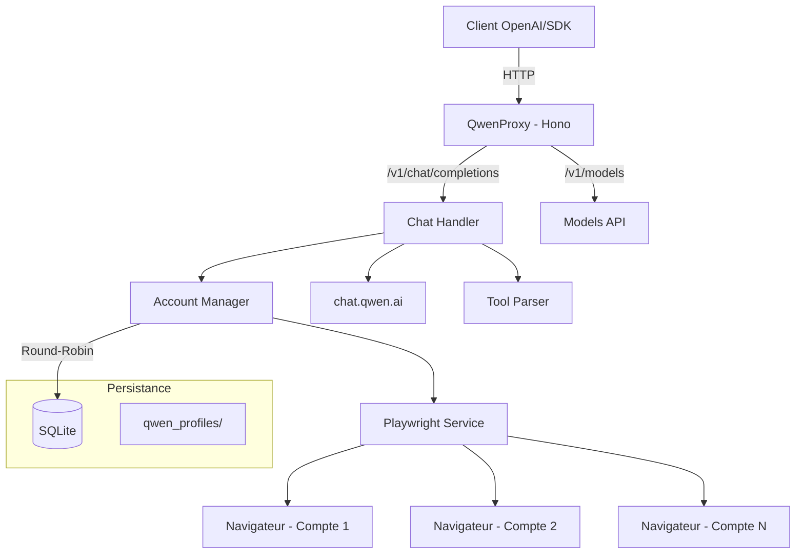

# QwenProxy

Proxy API local compatible avec OpenAI qui route les requêtes vers les modèles de **Qwen (chat.qwen.ai)** via automatisation de navigateur avec Playwright. Support multi-comptes avec rotation automatique, exécution d'outils, mode raisonnement (thinking), persistance de session et stockage en SQLite.

[](https://github.com/pedrofariasx/qwenproxy/actions/workflows/ci.yml)
[](https://www.typescriptlang.org/)
[](https://hono.dev/)
[](https://playwright.dev/)
[](LICENSE)

> **Projet original :** Ce projet est basé sur [pedrofariasx/qwenproxy](https://github.com/pedrofariasx/qwenproxy). Merci à Pedro Farias pour le travail initial.

---

## Fonctionnalités

- **Multi-Protocole** — Supporte les APIs OpenAI, Anthropic Messages et Google Gemini.
- **Custom Model Mapping** — Routez les modèles vers Qwen avec mapping flexible et hot-reload.
- **API Compatible OpenAI** — Interface compatible avec `/v1/chat/completions`, `/v1/models` et `/v1/upload`.
- **Anthropic Compatible** — Endpoint `/v1/messages` pour Claude Code, Cursor, etc.
- **Gemini Compatible** — Endpoint `/v1beta/models/:model/generateContent`.
- **Multi-Account** — Gérez plusieurs comptes Qwen avec rotation round-robin et cooldown automatique.
- **Mode Invité** — Mode invité sans connexion nécessaire, utilisant l'API publique de Qwen.
- **Historique des Requêtes** — Historique complet avec SQLite, filtrage et statistiques.
- **Tableau de Bord Web** — Interface web avec stats en temps réel, graphiques et éditeur de mapping.
- **Stockage SQLite** — Comptes enregistrés en base de données SQLite (mode WAL) pour la performance et la fiabilité.
- **Support du Reasoning** — Support complet du mode raisonnement (thinking) des modèles Qwen.
- **Upload Multimodal** — Envoi d'images, vidéos, audios et documents via `/v1/upload`.
- **Exécution d'Outils** — Système d'exécution d'outils locaux intégré au flux de chat.
- **Rate Limiting** — Limiteur de débit par clé API et IP avec headers standard.
- **Circuit Breaker** — Protection contre les cascades d'échec.
- **Persistance de Session** — Profil de navigateur persistant par compte dans `qwen_profiles/`.
- **Connexion Automatique** — Login automatique via identifiants avec récupération de session.
- **Sélection de Navigateur** — Choisissez entre Chromium, Chrome, Firefox, Edge ou WebKit.
- **Anti-Détection** — Script stealth avancé et captcha solver automatisé (Baxia).
- **Monitoring** — Health check détaillé, métriques Prometheus et watchdog intégrés.
- **Support Redis** — Support Upstash REST pour les déploiements serverless.
- **Prêt pour Serverless** — Déploiement sur Vercel, Netlify, etc.
- **Binaire CLI** — Installation globale via npm et utilisation de la commande `qwenproxy` directement.
- **Prêt pour Docker** — Déploiement sur VPS avec Docker, volumes persistants et arrêt gracieux.
- **Optimisation Vitesse** — Zero-copy stream, TLS pool, CDP batching, WebSocket bridge, mode browser-direct, cache Service Worker (6x plus rapide, 240x sur hit de cache).
- **Architecture Refactorisée** — Code dédupliqué entre les protocoles, `createQwenStream` décomposé en sous-fonctions testables, module partagé `request-executor.ts`.
- **Hot-Reload Config** — 18 clés configurables modifiables à l'exécution via API/dashboard (rate limiter, circuit breaker, timeouts, cache TTL, etc.).
- **Rate Limiter à Fenêtre Glissante** — Fin des pics aux limites de fenêtre, headers retry-after précis.
- **Chronométrage des Requêtes** — TTFB, temps de création du stream, suivi des hits de cache par requête.
- **Navigateur Protégé par Mutex** — Création/reset du contexte compte protégé contre les conditions de concurrence.
- **Monitoring Amélioré** — Métriques mémoire (heap/RSS/external), délai de boucle d'événements, stats GC, mémoire cache, stats du pool préchauffé, sessions actives dans `/health`.

---

## Architecture



### Optimisation Vitesse (Vitesse Éclair)

```
Control Plane (Node.js) ←→ WebSocket /ws/signaling ←→ Browser
Data Plane (Browser) ←→ Qwen API direct (HTTPS)
```

| Phase | Description | Gain |
|-------|-------------|------|
| 1 | Zero-Copy Stream — Réécriture SSE basée sur template | 10-50x/chunk |
| 2 | Élimination du CDP Bridge — Batch + WebSocket | 50-200x |
| 3 | Pool de Connexions TLS — Multiplexage HTTP/2 | 100-300ms |
| 4 | SSE côté client — Service Worker | 50-200ms |
| 5 | Mode Browser-Direct — Signalisation WebSocket | BYPASS |
| 6 | HTTP/3 + QUIC — 0-RTT | 50-150ms |
| 7 | Cache Multi-Niveaux — IndexedDB + SW | 0ms hit |
| 8 | Monitoring — Basculement automatique de chemin | fiabilité |

**Config :** `FAST_STREAM_PROXY=true TLS_POOL_SIZE=5 npm start`
**Benchmark :** `npm run bench`
**Docs :** [SPEED.md](SPEED.md)

### Endpoints de Monitoring

| Endpoint | Description |
|----------|-------------|
| `/health` | Health check complet avec 10 vérifications de sous-systèmes (navigateur, comptes, cache, pool préchauffé, pool TLS, sessions, debug, mémoire, délai de boucle d'événements) |
| `/metrics` | Métriques au format Prometheus |
| `/v1/performance` | Suivi de latence en temps réel, sélection de chemin, stats du pool TLS |

---

## Hot-Reload Configuration

Toute la configuration peut être modifiée en temps réel sans redémarrage du serveur.

### Via API

```bash
# Voir la configuration complète
curl http://localhost:3000/api/config/server

# Modifier un timeout
curl -X PUT http://localhost:3000/api/config/server \
  -H 'Content-Type: application/json' \
  -d '{"path":"timeouts.http","value":60000}'

# Passer en mode browser (désactiver le direct fetch)
curl -X PUT http://localhost:3000/api/config/server \
  -H 'Content-Type: application/json' \
  -d '{"path":"directFetch","value":false}'

# Mise à jour en lot
curl -X PUT http://localhost:3000/api/config/server/batch \
  -H 'Content-Type: application/json' \
  -d '{"updates":[{"path":"timeouts.http","value":45000},{"path":"cache.defaultTTL","value":7200}]}'

# Réinitialiser aux valeurs par défaut
curl -X POST http://localhost:3000/api/config/server/reset
```

### Via le Tableau de Bord

Accédez à `http://localhost:3000` → onglet **Paramètres** pour modifier directement toutes les valeurs dans l'interface web.

### Catégories de Configuration

| Type | Exemples | Comportement |
|------|----------|--------------|
| **Hot-reload immédiat** | `timeouts.*`, `cache.*`, `directFetch`, `apiKey` | Effet immédiat à la prochaine requête |
| **Hot-reload avec action** | `browser.headless`, `browser.type`, `metrics.interval` | Redémarre automatiquement le sous-système |
| **Nécessite un restart** | `server.port`, `server.host`, `redis.*` | Valeur enregistrée, effet au prochain démarrage |

### Persistance

Les modifications sont enregistrées dans `config/runtime-config.json` et restaurées automatiquement au prochain démarrage du serveur.

### Nouvelles Clés Hot-Reloadable (v1.8.0+)

| Clé | Type | Défaut | Description |
|-----|------|--------|-------------|
| `rateLimit.windowMs` | number | 60000 | Fenêtre du rate limiter (ms) |
| `rateLimit.maxRequests` | number | 100 | Nombre max de requêtes par fenêtre |
| `circuitBreaker.failureThreshold` | number | 5 | Échecs avant ouverture du circuit |
| `circuitBreaker.resetTimeoutMs` | number | 60000 | Timeout avant demi-ouverture (ms) |
| `circuitBreaker.successThreshold` | number | 3 | Succès pour fermer le circuit |

---

## Mode Debug

Mode de diagnostic qui capture toute l'activité interne du proxy.

### Activation/Désactivation

```bash
# Via API
curl -X POST http://localhost:3000/api/debug/toggle

# Vérifier le statut
curl http://localhost:3000/api/debug/status

# Consulter les logs
curl http://localhost:3000/api/debug/logs

# Filtrer par catégorie
curl "http://localhost:3000/api/debug/logs?category=ERROR"

# Nettoyer les logs
curl -X DELETE http://localhost:3000/api/debug/logs
```

### Via le Tableau de Bord

Accédez à `http://localhost:3000` → onglet **Debug** pour activer/désactiver et visualiser les logs en temps réel.

### Catégories de Logs

| Catégorie | Description |
|-----------|-------------|
| `REQUEST` | Requêtes reçues (model, stream, messageCount) |
| `RESPONSE` | Réponses envoyées (status, duration) |
| `MAPPING` | Résolution de modèle (source → target, matchedBy) |
| `CACHE` | Opérations de cache (hit/miss, key, size) |
| `ACCOUNT` | Sélection de compte (account selection, cooldown) |
| `STREAM` | Création de streams (accountId, duration) |
| `BROWSER` | Opérations Playwright (launch, context, navigation) |
| `ERROR` | Erreurs avec stack trace complète |
| `INTERNAL` | Transitions internes (circuit breaker, etc.) |
| `TIMING` | Mesures de temps détaillées |

### Variables d'Environnement

```bash
DEBUG_MODE=false        # État initial (toggle via API/dashboard)
DEBUG_BUFFER_SIZE=5000  # Taille du ring buffer
DEBUG_PERSIST=false     # Persister l'état sur disque
```

---

## Prérequis

| Dépendance | Version Minimale | Installation |
|------------|-----------------|--------------|
| Node.js | v20.x | [nvm](https://github.com/nvm-sh/nvm) |
| npm | v9.x | Inclus avec Node.js |
| Playwright | - | `npx playwright install` |
| Docker (optionnel) | v24.x | [Docker Docs](https://docs.docker.com/get-docker/) |

---

## Installation

### Via npm (Global)

```bash
npm install -g @pedrofariasx/qwenproxy
npx playwright install
qwenproxy
```

### Via npm (Local)

```bash
git clone https://github.com/pedrofariasx/qwenproxy.git
cd qwenproxy
npm install
npx playwright install
```

### Via Docker

```bash
docker-compose up -d
```

---

## Configuration

Créez le fichier `.env` à la racine du projet (voir `.env.example`) :

```env
# Port du serveur (défaut : 3000)
PORT=3000

# Hôte du serveur (défaut : 0.0.0.0)
HOST=0.0.0.0

# Clé API pour protéger les endpoints (optionnel)
API_KEY=votre-clé-secrète-ici

# Identifiants Qwen pour la connexion automatique (mode mono-compte)
QWEN_EMAIL=votre-email@exemple.com
QWEN_PASSWORD=votre-mot-de-passe-ici

# Mode invité - sans connexion, utilise l'API publique (défaut : false)
QWEN_GUEST_MODE_ONLY=false

# Navigateur (chromium, firefox, chrome, edge, webkit)
BROWSER=chromium

# Exécuter le navigateur sans interface graphique (défaut : true)
HEADLESS=true

# Timeouts (millisecondes)
NAVIGATION_TIMEOUT=45000
PAGE_TIMEOUT=30000
HTTP_TIMEOUT=30000
HEADERS_TIMEOUT=60000
CHAT_TIMEOUT=120000
STREAM_IDLE_TIMEOUT=180000
```

---

## Gestion des Comptes

Les comptes sont stockés en SQLite (`data/qwenproxy.db`). Utilisez le CLI interactif pour les gérer :

```bash
# Ouvrir le gestionnaire de comptes
npm run login

# Avec un navigateur spécifique
npm run login:firefox
npm run login:chrome
npm run login:edge
```

Le menu interactif permet :
- **[A]** Ajouter un compte avec identifiants (email + mot de passe)
- **[M]** Ajouter un compte via connexion manuelle dans le navigateur
- **[R]** Supprimer un compte
- **[L]** Se connecter à tous les comptes (initialiser les sessions)

> Lors de la première exécution, s'il existe un ancien `accounts.json`, les comptes seront migrés automatiquement vers SQLite.

---

## Utilisation

### Démarrer le serveur

```bash
npm start                  # Chromium (par défaut)
npm run start:chrome       # Google Chrome
npm run start:firefox      # Firefox
npm run start:edge         # Microsoft Edge
```

Le serveur démarre sur `http://localhost:3000` avec les routes suivantes :

| Route | Méthode | Description |
|-------|---------|-------------|
| `/v1/chat/completions` | POST | Chat completions (streaming + non-streaming) |
| `/v1/chat/completions/stop` | POST | Interrompre une génération en cours |
| `/v1/models` | GET | Lister les modèles disponibles |
| `/v1/models/:model` | GET | Informations d'un modèle spécifique |
| `/v1/upload` | POST | Upload de fichiers multimodaux (images, vidéos, audios, documents) |
| `/v1/messages` | POST | Anthropic Messages API (Claude Code, Cursor, etc.) |
| `/v1/performance` | GET | Statistiques de performance en temps réel |
| `/health` | GET | Health check avec statut du système |
| `/metrics` | GET | Métriques au format Prometheus |
| `/api/config/server` | GET/PUT | Configuration du serveur (hot-reloadable) |
| `/api/config/server/batch` | PUT | Mise à jour en lot de la configuration |
| `/api/config/server/reset` | POST | Réinitialiser la configuration aux valeurs par défaut |
| `/api/config/server/defaults` | GET | Valeurs par défaut de la configuration |
| `/api/config/mapping` | GET/PUT | Configuration du model mapping |
| `/api/config/mappings` | GET/POST | CRUD des model mappings |
| `/api/config/routes` | GET/POST | CRUD des routes personnalisées |
| `/api/config/aliases` | GET/POST | CRUD des aliases |
| `/api/history` | GET/DELETE | Historique des requêtes |
| `/api/stats` | GET | Statistiques agrégées |
| `/api/debug/status` | GET | Statut du mode debug |
| `/api/debug/toggle` | POST | Activer/désactiver le mode debug |
| `/api/debug/logs` | GET/DELETE | Logs de debug (ring buffer) |

---

## Exemples d'Intégration

### OpenAI SDK (Node.js)

```typescript
import OpenAI from 'openai';

const openai = new OpenAI({
  baseURL: 'http://localhost:3000/v1',
  apiKey: process.env.API_KEY || 'sk-no-key-required'
});

const completion = await openai.chat.completions.create({
  model: 'qwen-plus',
  messages: [{ role: 'user', content: 'Explique comment fonctionne Playwright.' }]
});

console.log(completion.choices[0].message.content);
```

### cURL

```bash
curl http://localhost:3000/v1/chat/completions \
  -H "Content-Type: application/json" \
  -H "Authorization: Bearer votre-clé" \
  -d '{
    "model": "qwen-plus",
    "messages": [{"role": "user", "content": "Bonjour !"}],
    "stream": true
  }'
```

---

## Déploiement avec Docker

### docker-compose.yml

```yaml
services:
  qwenproxy:
    build: .
    container_name: qwenproxy
    ports:
      - "${PORT:-3000}:3000"
    env_file:
      - .env
    volumes:
      - ./data:/app/data               # Base SQLite
      - ./qwen_profiles:/app/qwen_profiles  # Sessions des navigateurs
    restart: unless-stopped
    logging:
      driver: "json-file"
      options:
        max-size: "10m"
        max-file: "3"
```

### Volumes persistants

| Volume | Contenu |
|--------|---------|
| `./data` | Base SQLite avec les comptes (`qwenproxy.db`) |
| `./qwen_profiles` | Profils de navigateur par compte (cookies, sessions) |

---

## Structure du Projet

```
qwenproxy/
├── bin/
│   └── qwenproxy.mjs            # Point d'entrée du CLI binaire
├── src/
│   ├── index.ts                 # Point d'entrée du serveur
│   ├── login.ts                 # CLI de gestion des comptes
│   ├── api/
│   │   ├── models.ts            # Endpoints /v1/models
│   │   └── server.ts            # Serveur Hono + démarrage
│   ├── cache/
│   │   └── memory-cache.ts      # Cache en mémoire avec TTL
│   ├── core/
│   │   ├── account-manager.ts   # Rotation round-robin + cooldowns
│   │   ├── accounts.ts          # CRUD des comptes (SQLite)
│   │   ├── config.ts            # Configuration avec Zod
│   │   ├── crypto-utils.ts      # Chiffrement des mots de passe au repos
│   │   ├── database.ts          # Connexion et migrations SQLite
│   │   ├── logger.ts            # Logger structuré
│   │   ├── metrics.ts           # Collecte de métriques Prometheus
│   │   ├── model-registry.ts    # Registre des modèles et context windows
│   │   ├── stream-registry.ts   # Suivi des streams actifs
│   │   └── watchdog.ts          # Health monitoring
│   ├── routes/
│   │   ├── request-executor.ts   # Logique session/compte partagée (déduplication)
│   │   ├── chat.ts              # Handler /v1/chat/completions
│   │   ├── sse-parser.ts        # Parser incrémental SSE + delta
│   │   ├── stream-handler.ts    # Orchestration du streaming SSE
│   │   ├── tool-handler.ts      # Exécution des outils locaux
│   │   └── upload.ts            # Handler /v1/upload (multimodal)
│   ├── services/
│   │   ├── browser-manager.ts   # Cycle de vie des navigateurs/contexts
│   │   ├── error-handler.ts     # Typage et retry des erreurs Qwen
│   │   ├── header-interceptor.ts # Capture de cookies/headers via CDP
│   │   ├── playwright.ts        # Façade du service Playwright
│   │   ├── qwen.ts              # Intégration avec l'API Qwen
│   │   ├── stealth.ts           # Script anti-détection
│   │   ├── stream-bridge.ts     # Pont de stream navigateur → Node
│   │   ├── stream-creator.ts    # Création de chats et streams Qwen
│   │   └── warm-pool.ts         # Pool de chats préchauffés
│   ├── tests/                   # Tests automatisés (node:test)
│   ├── tools/
│   │   ├── parser.ts            # Parser des balises <tool_call>
│   │   ├── registry.ts          # Registre des outils
│   │   ├── schema.ts            # Validation JSON Schema
│   │   └── types.ts             # Types du système d'outils
│   └── utils/
│       ├── context-truncation.ts # Troncature de contexte
│       ├── json.ts              # Parser JSON robuste
│       ├── qwen-stream-parser.ts # Parser des streams SSE de Qwen
│       └── types.ts             # Ré-exports de types
├── data/                        # Base SQLite (gitignored)
├── qwen_profiles/               # Profils de navigateur par compte (gitignored)
├── Dockerfile
├── docker-compose.yml
├── tsconfig.json
├── tsconfig.build.json
└── package.json
```

---

## Dépannage

| Problème | Solution |
|----------|----------|
| Port déjà utilisé | Modifiez `PORT` dans `.env` ou terminez le processus sur le port 3000 |
| Le navigateur ne s'ouvre pas | Exécutez `npx playwright install` |
| Session expirée | Exécutez `npm run login` pour renouveler les cookies |
| Rate limit sur tous les comptes | Ajoutez plus de comptes via `npm run login` |
| Base de données corrompue | Supprimez `data/qwenproxy.db` et ré-ajoutez les comptes |

---

## Avertissement

> Ce projet est fourni strictement à des fins éducatives et de recherche.

Les auteurs n'encouragent ni ne soutiennent :
- La violation des Conditions d'Utilisation de la plateforme Qwen.
- L'automatisation non autorisée à grande échelle.
- L'utilisation à des fins malveillantes.

**Utilisez à vos propres risques.**
